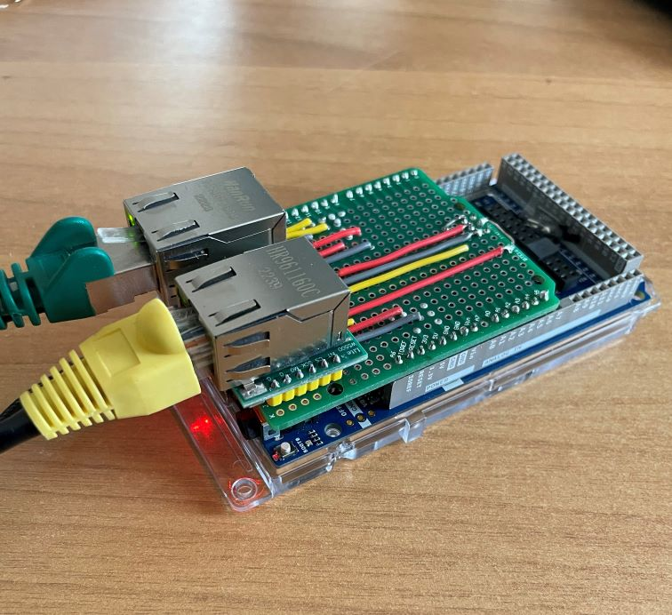

# Arduino GIGA R1 WIFI - Dual Ethernet
Very often, for industrial or very particular applications, it is mandatory to separate the ethernet networks and work with two IP addresses from different groups.

For example, if we need to collect data from a PLC that has a private network and convey them to a server/mes, we need to be able to manage two different IP addresses.
Or, if we want to create a protocol converter between two devices on different networks

To do this we need two Ethernet adapters that can be configured with two different IPs and which, it would be great, could work in parallel.

Unfortunately, the Arduino boards, until now, were equipped with only one SPI interface to which to connect a SPI/Ethernet module (for example Ethernet Shield or similar).

Today with Arduino GIGA R1 WIFI things change: we can use two WIZnet Ethernet adapters on two SPI ports and make them work **simultaneously** and thread-safely.

## The hardware

To achieve this we can create a dedicated shield equipped with two WIZnet adapters (W5500 for example) or, if we already have an Ethernet shield, we can just connect the second adapter to the second SPI port.


## Dual Ethernet Shield

Using an Arduino prototype board (clone) and two WIZnet W5500 lite module is very simple to build a dual Ethernet shield.\
Below the schematic diagram; I reported also the pinout of a "standard" W5500 module, if you plan to use a prototype board there is no available room for both of them, but if you intend to use a different board, these modules are an alternative.


I suggest you to use a clone proto shield because the original one has an unusable area for our purposes, as you can see from the figure.


Below the wiring.


..and the final result


running 




## Arduino Ethernet Shield + External WIZnet adapter

If you already have an Arduino Ethernet shield 2, you can connect a second external adapter, or, if you want a more compact implementation, you can use a proto shield like the one already seen mounting only the second adapter.

This is the connection diagram


And this is a running prototype


> <note id ="note"> <i class="fa fa-pencil"></i> Note</note>\
> Using Arduino Ethernet Shield 2 we cannot access the **rst** pin of the SPI connector. To properly reset the second adapter, we should use a GPIO pin as "open collector". Please refer to the example. 

## The library

Unfortunately the standard Arduino Ethernet library is largely hardwired on the first SPI interface and all classes (W5100, Ethernet, etc) contain many static methods and reference global variables and instances.

At this point there were two ways: modify the library by introducing a constant parameter for each function or method that indicated the SPI interface to be used.
Or duplicate the library completely.

Even if it requires more memory (but GIGA R1 WIFI has plenty of it) I chose the second method because, by separating everything, we can use the library in a multithreaded environment without having to interlock all the global methods (which would have greatly penalized the performances).
Also, if a new version of the official Ethernet library comes out in the future, it's easier to update this one.

To use this library you have simply to include Ethernet_SPI2.h.\
Here the most popular Ethernet example : the WebServer, but here it works with two adapters.

```c
/*
 Dual Web Server
  
 A quick and dirty example of using two Ethernet adapters contemporary on Arduino GIGA R1 WIFI 
 please refer to ..
 for hardware examples

 2023 Dave Nardella

*/

/*
 Original credits
 -----------------------
 created 18 Dec 2009
 by David A. Mellis
 modified 9 Apr 2012
 by Tom Igoe
 modified 02 Sept 2015
 by Arturo Guadalupi
 
 */

#include <SPI.h>
#include <Ethernet.h>
#include <Ethernet_SPI2.h>

// Enter a MAC address and IP address for your controller below.
// The IP address will be dependent on your local network:
byte mac_SPI1[] = {
  0xDE, 0xAD, 0xBE, 0xEF, 0xFE, 0xED
};

byte mac_SPI2[] = {
  0xDE, 0xAD, 0xBE, 0xEF, 0xFE, 0xEF
};

IPAddress ip_SPI1(192, 168, 0, 177);
IPAddress ip_SPI2(192, 168, 0, 178);

// Initialize the Ethernet servers

EthernetServer server_1(80);
EthernetServer_SPI2 server_2(80);


void setup() {
  bool not_IF1;
  bool not_IF2;

// If you intend to use ETH0 on Ethernet shield and a Wiznet chip as ETH1 you could need 
// of an hardware reset pin.
// To do this connect the WXXXX reset pin on D8 (for example) and uncomment next lines
// DO NOT MODIFY THE ORDER OF THE FIRST TWO LINES
/*
  digitalWrite(8, LOW); 
  pinMode(8, OUTPUT);
  delay(650);
  pinMode(8, INPUT);
*/

  // Open serial communications and wait for port to open:
  Serial.begin(9600);
  while (!Serial) {
    ; // wait for serial port to connect. Needed for native USB port only
  }
  Serial.println("Double Ethernet WebServer Example");

  // start the Ethernet connection and the server on 1st SPI Interface
  Ethernet.init(10);   
  Ethernet.begin(mac_SPI1, ip_SPI1);

  // start the Ethernet connection and the server on 2nd SPI interface
  Ethernet_SPI2.init(9);   // Double Ethernet shield
  Ethernet_SPI2.begin(mac_SPI2, ip_SPI2);

  // Check for Ethernet hardware present on 1st SPI
  not_IF1 = Ethernet.hardwareStatus() == EthernetNoHardware;
  not_IF2 = Ethernet_SPI2.hardwareStatus() == EthernetNoHardware_SPI2;

  if (not_IF1 && not_IF2)
  {
    Serial.println("Ethernet adapters were not found on both SPI interfaces.  Sorry, can't run without hardware. :(");
    while (true) {
      delay(1); // do nothing, no point running without Ethernet hardware
    }
  }
  else{
    if (not_IF1)
      Serial.println("Ethernet adapter was not found on 1st SPI");
    if (not_IF2)
      Serial.println("Ethernet adapter was not found on 2nd SPI");
  }

  // Check for link status
  if (Ethernet.linkStatus() == LinkOFF) 
    Serial.println("Ethernet cable is not connected on ETH0.");
 
  if (Ethernet_SPI2.linkStatus() == LinkOFF_SPI2) 
    Serial.println("Ethernet cable is not connected on ETH1.");
  
  // start the 1st server
  server_1.begin();
  Serial.print("ETH0 server is at ");
  Serial.println(Ethernet.localIP());

  // start the 2nd server
  server_2.begin();
  Serial.print("ETH1 server is at ");
  Serial.println(Ethernet_SPI2.localIP());
}


void loop() {
  // ***********************************  
  // SERVER ON ETH0
  // ***********************************  
  
  // listen for incoming clients
  EthernetClient client_1 = server_1.available();
  if (client_1) 
  {
    Serial.println("new client on ETH0");
    // an HTTP request ends with a blank line
    bool currentLineIsBlank = true;
    while (client_1.connected()) 
    {
      if (client_1.available()) {
        char c = client_1.read();
        Serial.write(c);
        // if you've gotten to the end of the line (received a newline
        // character) and the line is blank, the HTTP request has ended,
        // so you can send a reply
        if (c == '\n' && currentLineIsBlank) {
          // send a standard HTTP response header
          client_1.println("HTTP/1.1 200 OK");
          client_1.println("Content-Type: text/html");
          client_1.println("Connection: close");  // the connection will be closed after completion of the response
          client_1.println("Refresh: 5");  // refresh the page automatically every 5 sec
          client_1.println();
          client_1.println("<!DOCTYPE HTML>");
          client_1.println("<html>");
          // output the value of each analog input pin
          for (int analogChannel = 0; analogChannel < 6; analogChannel++) {
            int sensorReading = analogRead(analogChannel);
            client_1.print("ETH0 analog input ");
            client_1.print(analogChannel);
            client_1.print(" is ");
            client_1.print(sensorReading);
            client_1.println("<br />");
          }          
          client_1.println("</html>");
          break;
        }
        if (c == '\n') {
          // you're starting a new line
          currentLineIsBlank = true;
        } else if (c != '\r') {
          // you've gotten a character on the current line
          currentLineIsBlank = false;
        }
      }
    }
    // give the web browser time to receive the data
    delay(1);
    // close the connection:
    client_1.stop();
    Serial.println("client on ETH0 disconnected");
  }

  // ***********************************  
  // SERVER ON ETH1
  // ***********************************  

  // listen for incoming clients
  EthernetClient_SPI2 client_2 = server_2.available();
  if (client_2) 
  {
    Serial.println("new client on ETH1");
    // an HTTP request ends with a blank line
    bool currentLineIsBlank = true;
    while (client_2.connected()) 
    {
      if (client_2.available()) {
        char c = client_2.read();
        Serial.write(c);
        // if you've gotten to the end of the line (received a newline
        // character) and the line is blank, the HTTP request has ended,
        // so you can send a reply
        if (c == '\n' && currentLineIsBlank) {
          // send a standard HTTP response header
          client_2.println("HTTP/1.1 200 OK");
          client_2.println("Content-Type: text/html");
          client_2.println("Connection: close");  // the connection will be closed after completion of the response
          client_2.println("Refresh: 5");  // refresh the page automatically every 5 sec
          client_2.println();
          client_2.println("<!DOCTYPE HTML>");
          client_2.println("<html>");
          // output the value of each analog input pin
          for (int analogChannel = 0; analogChannel < 6; analogChannel++) {
            int sensorReading = analogRead(analogChannel);
            client_2.print("ETH1 analog input ");
            client_2.print(analogChannel);
            client_2.print(" is ");
            client_2.print(sensorReading);
            client_2.println("<br />");
          }          
          client_2.println("</html>");
          break;
        }
        if (c == '\n') {
          // you're starting a new line
          currentLineIsBlank = true;
        } else if (c != '\r') {
          // you've gotten a character on the current line
          currentLineIsBlank = false;
        }
      }
    }
    // give the web browser time to receive the data
    delay(1);
    // close the connection:
    client_2.stop();
    Serial.println("client on ETH1 disconnected");
  }

}

```
### Api
This library is derived directly from the original one remember only to change **Ethernet** in **Ethernet_SPI2** in your code.
please refer to the original documentation <a href="https://github.com/arduino-libraries/Ethernet" target="_blank">here</a>

### Installation
Download this repository as zip file then rename **Ethernet_SPI2-main.zip** in **Ethernet_SPI2.zip**

Into Arduino Ide, install this file, as usual


## License
The license is also the original one

---

Copyright (c) 2010 Arduino LLC. All right reserved.

This library is free software; you can redistribute it and/or modify it under the terms of the GNU Lesser General Public License as published by the Free Software Foundation; either version 2.1 of the License, or (at your option) any later version.

This library is distributed in the hope that it will be useful, but WITHOUT ANY WARRANTY; without even the implied warranty of MERCHANTABILITY or FITNESS FOR A PARTICULAR PURPOSE. See the GNU Lesser General Public License for more details.

You should have received a copy of the GNU Lesser General Public License along with this library; if not, write to the Free Software Foundation, Inc., 51 Franklin St, Fifth Floor, Boston, MA 02110-1301 USA
